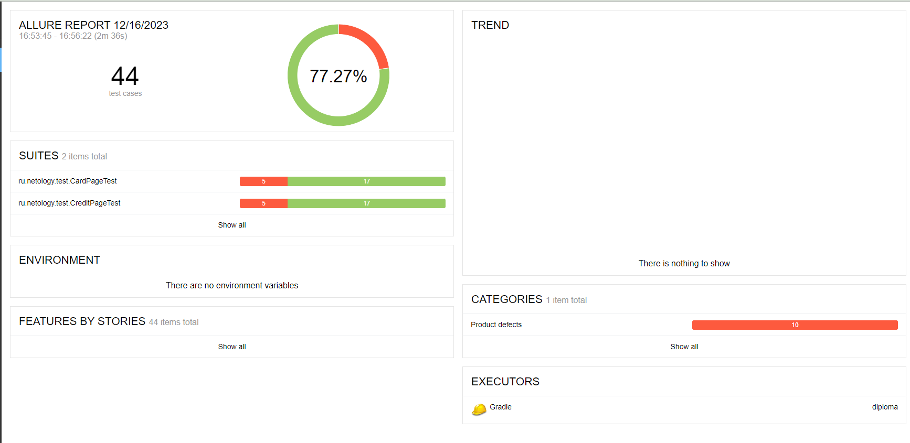
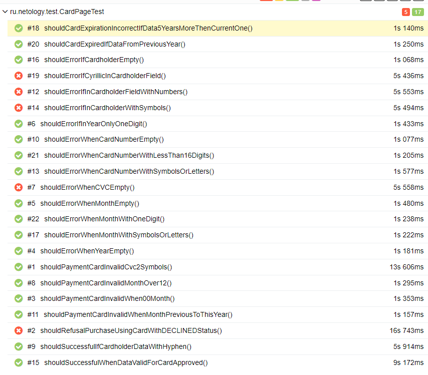
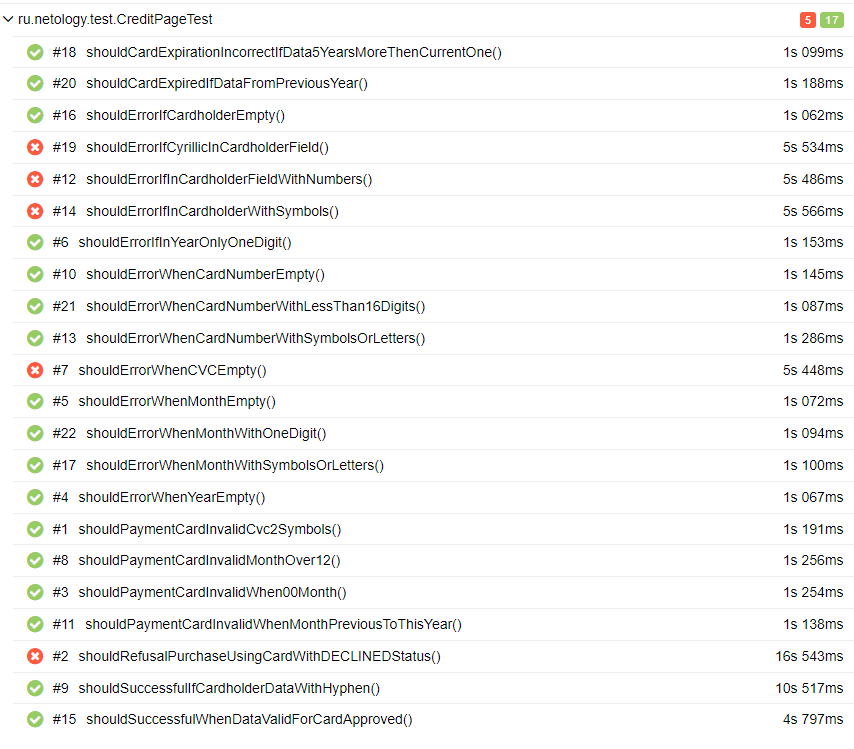

# Отчёт по итогам тестирования
## Краткое описание
Было проведено автоматизированное тестирование веб-сервиса покупки туров.
Протестирована поддержка двух СУБД: MySQL и PostgerSQL и возможность оплаты тура двумя способами:
* Обычная оплата по дебетовой карте
* Выдача кредита по данным банковской карты

## Количество тест-кейсов
Общее количество тест-кейсов 44, из них:
* 22 - оплата по дебетовой карте
* 22 - оплата в кредит
## Процент успешных и не успешных тест-кейсов
* 77.27% (34 теста) - успешных тест-кейсов
* 22.72% (10 тестов) - неуспешных тест-кейсов.
### Отчёт из Allure

#### Отчёт тестирования оплаты по дебетовой карте:

#### Отчёт тестирования покупки в кредит

## Общие рекомендации
* Исправить найденные ошибки в [issues ](https://github.com/lizvalk/Diploma/issues)
* Исправить текст уведомлений при пустых полях **Номер карты**, **Месяц**, **Год**, **CVC/CVV** на "Поле обязательно для заполнения" вместо "Неверный формат"
* Добавить исчезновение уведомлений об ошибках под полями **Номер карты**, **Владелец** и **CVC/CVV** когда они были исправлены пользователем